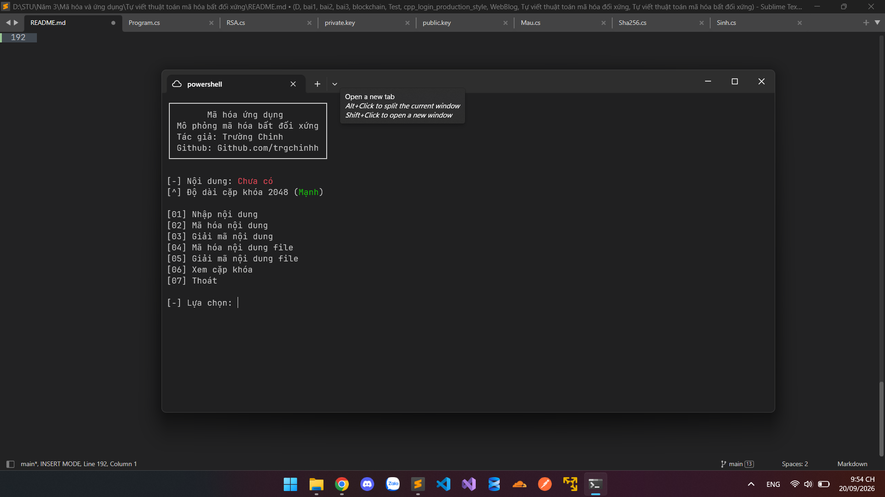

# TRIỂN KHAI MÃ HÓA BẤT ĐỐI XỨNG BẰNG C#

<p align="center">
  
</p>

<p align="center">
  <a href="https://github.com/trgchinhh/mophong-mahoabatdoixung">
    
  </a>
  <a href="LICENSE">
    
  </a>
  <a href="https://github.com/trgchinhh">
    
  </a>
</p>

Chương trình nhỏ mô phỏng thuật toán mã hóa bất đối xứng RSA tự build



---

## Giới thiệu

- **Mã hóa bất đối xứng:** là khái niệm mã hóa sử dụng 2 khóa khác nhau gồm khóa công khai (public key) và khóa riêng tư (private key)
  - Dữ liệu được mã hóa bằng khóa công khai thì dùng khóa riêng tư để giải mã
  - Khóa công khai có thể chia sẻ cho mọi người
    - Trong hệ thống blockchain, khóa công khai có thể được dùng làm cơ sở để tạo địa chỉ ví để mọi người có thể sử dụng địa chỉ đó để chuyển tài sản cho bạn
  - Khóa riêng tư phải được giữ bí mật
    - Nó như mật khẩu vì chỉ có nó mới có thể giải mã nội dung mà khóa công khai mã hóa
  - => Vì thế nó được xem là mã hóa bất đối xứng (ngược nhau)

- **Hàm băm (hash):** là khái niệm 1 chiều, độ dài không đổi tùy thuật toán sẽ cho ra độ dài cố định khác nhau
  - Dùng để kiểm tra tính toàn vẹn dữ liệu

---

## Thành phần

- `P`: nội dung (bản rõ)
- `C`: nội dung sau mã hóa (bản mã)
- `p`: số nguyên tố thứ nhất
- `q`: số nguyên tố thứ hai
- `n`: tích của p và q
- `φ(n)`: hàm phi Euler
- `e`: khóa công khai
- `d`: khóa riêng tư

---

## Các phép biến đổi

- `gcd`: tìm ước chung lớn nhất của 2 số
- `mod`: phép chia lấy dư (%)
- `nghịch đảo modulo`: tìm số d sao cho (e × d) mod φ(n) = 1
- `lũy thừa modulo`: tính (a^b) mod n mà không cần tính trực tiếp a^b

---

## Công thức tạo khóa

```
n = p × q
φ(n) = (p - 1) × (q - 1)
gcd(e, φ(n)) = 1
d = e⁻¹ mod φ(n
```

- trong đó p, q là 2 số nguyên tố khác nhau
- n là modulo được sử dụng trong quá trình mã hóa và giải mã
- φ(n) là số lượng số nguyên dương nhỏ hơn n và nguyên tố cùng nhau với n
- e là khóa công khai
- d là khóa riêng tư

**Vì sao e phải nguyên tố cùng nhau với φ(n)**

Vì cần tồn tại nghịch đảo modulo của e để tìm được d

**Vì sao phải có p và q**

Vì RSA dựa trên tích của 2 số nguyên tố lớn p × q, việc phân tích n để tìm lại p và q là bài toán khó khi số đủ lớn

```
VD:
  p = 61
  q = 53
  n = p × q = 3233
  φ(n) = (61 - 1) × (53 - 1) = 3120
  Chọn e = 17
    Vì gcd(17, 3120) = 1 nên e hợp lệ
  Tìm d sao cho:
    (e × d) mod φ(n) = 1
    (17 × d) mod 3120 = 1
  → d = 2753
  (17 × 2753) mod 3120 = 1
  e = 17
  d = 2753
```

---

## Công thức mã hóa

```
C = P^e mod n
```

- C là nội dung P lũy thừa với khóa công khai e chia lấy dư với n

```
[*] Công thức chung: C = P^e mod n
```

---

## Công thức giải mã

```
P = C^d mod n
```

- Lấy bản mã C lũy thừa với khóa riêng tư d

```
[*] Công thức chung: P = C^d mod n
```

---

## Quá trình

- Quá trình tạo khóa sẽ sinh ra 2 số nguyên tố lớn p và q
- Từ p và q tính ra n và φ(n)
- Chọn e sao cho gcd(e, φ(n)) = 1 (tính khóa công khai)
- Từ e và φ(n) tính ra d bằng nghịch đảo modulo (tính khóa riêng tư)
- Khóa công khai gồm e và n (e;n)
- Khóa riêng tư gồm d và n (d;n)
- Quá trình mã hóa sử dụng khóa công khai
- Quá trình giải mã sử dụng khóa riêng tư
- Sau khi giải mã có thể dùng SHA-256 để kiểm tra nội dung trước và sau có giống nhau hay không

---

## Ví dụ

```
Bản rõ P = 65
Khóa công khai: e = 17, n = 3233
Khóa riêng tư: d = 2753, n = 3233

Mã hóa:
  C = 65^17 mod 3233
  C = 2790

Giải mã:
  P = 2790^2753 mod 3233
  P = 65
  -> Nội dung sau khi giải mã quay trở lại đúng bản rõ ban đầu
```

---

## Lưu khóa

- Khóa công khai được lưu tại: `keys/public.key`
- Khóa riêng tư được lưu tại: `keys/private.key`

---

## Đút kết

- RSA sử dụng 2 khóa khác nhau nên được gọi là mã hóa bất đối xứng
- Khóa công khai dùng để mã hóa, khóa riêng tư dùng để giải mã
- Điểm hay của RSA là chỉ cần gửi gửi khóa công khai của mình để mã hóa dữ liệu mà không lo bên thứ 3 có thể đánh cắp và giải mã ngược lại vì độ phức tạp cực lớn

> Với công thức là 2^n với n là số bit của cặp khóa
> VD: nếu dùng cặp khóa 4096 bit thì có số trường hợp biểu diễn là 2^4096

```
        MÃ HÓA     │     GIẢI MÃ
     ──────────────┼───────────────
      - khóa e     │    - khóa d
      - bản rõ P   │    - bản mã C
      - P^e mod n  │    - C^d mod n
      - ra C       │    - ra P
```

---

## Cách cài đặt

```bash
git clone https://github.com/trgchinhh/mophong-mahoabatdoixung.git
cd .\mophong-mahoabatdoixung
dotnet run
```

---

## Tác giả
**Nguyễn Trường Chinh (NTC++)**<br>
**GitHub:** [https://github.com/trgchinhh](https://github.com/trgchinhh)

---

> 📌 Dự án nhỏ được phát triển với mục đích học tập và nghiên cứu. Mọi góp ý và đóng góp đều được hoan nghênh.